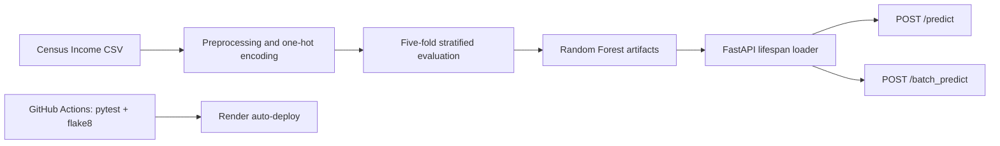

# Census Income Prediction API

[](https://github.com/trzhang-ai/Deploying-a-ML-Model-to-Cloud-Application-Platform-with-FastAPI/actions/workflows/ci.yml)

A lockfile-backed machine-learning inference service for classifying Census Income
records. The project combines a scikit-learn Random Forest model, typed FastAPI
endpoints, slice-level evaluation, automated tests, and CI-gated deployment on
Render.

| Resource | Link |
| --- | --- |
| Hosted API | [Render service — currently suspended](https://deploying-a-ml-model-to-cloud-fjou.onrender.com/) |
| Interactive OpenAPI docs | [Swagger UI — available after resuming](https://deploying-a-ml-model-to-cloud-fjou.onrender.com/docs) |
| Model documentation | [Model card](starter/model_card_template.md) |
| CI workflow | [GitHub Actions](https://github.com/trzhang-ai/Deploying-a-ML-Model-to-Cloud-Application-Platform-with-FastAPI/actions/workflows/ci.yml) |

> **Deployment status:** The Render web service is intentionally suspended
> after its live GET and POST endpoints and CI-gated deployment were verified.
> Suspending it prevents idle cloud-resource usage while preserving the service
> configuration and deployment history. Resume it before using the hosted API
> or Swagger UI; the application remains fully runnable locally.

## What this project demonstrates

- Reproducible dependency management with Python 3.13, `uv`, and `uv.lock`.
- Five-fold stratified cross-validation with fold-local categorical encoding.
- A serialized Random Forest classifier, encoder, and label binarizer.
- Aggregate precision, recall, and F1 reporting plus categorical slice metrics.
- Typed single-record and batch inference endpoints with Pydantic aliases.
- API and model tests enforced by GitHub Actions before Render auto-deployment.
- Explicit model limitations and high-impact-use restrictions in a model card.

## System design



The application loads the trained classifier and preprocessing artifacts once
during startup. Requests are validated by Pydantic, converted to a DataFrame,
processed with the fitted encoder, and returned as one of the two label values:
`<=50K` or `>50K`.

## Evaluation summary

The positive class is `>50K`. Metrics are the mean and standard deviation over
five stratified cross-validation folds.

| Metric | Mean | Standard deviation |
| --- | ---: | ---: |
| Precision | 0.735 | 0.007 |
| Recall | 0.627 | 0.010 |
| F1 score | 0.677 | 0.008 |

See the [model card](starter/model_card_template.md) for data assumptions,
slice-analysis methodology, ethical considerations, and evaluation limits.

## API

| Method | Endpoint | Purpose |
| --- | --- | --- |
| `GET` | `/` | Health and welcome response |
| `POST` | `/predict` | Predict one record |
| `POST` | `/batch_predict` | Predict one or more records |

After resuming the hosted service, run the committed request client:

```bash
uv run --locked python test_request.py
```

Example response:

```text
Status code: 200
{'prediction': '<=50K'}
```

## Run locally

Install the locked environment and start the API:

```bash
uv sync --locked
uv run --locked uvicorn starter.main:app --reload
```

Open <http://127.0.0.1:8000/docs> for the interactive API schema.

Run the verification suite:

```bash
uv run --locked pytest
uv run --locked flake8 starter/main.py starter/starter/ml/data.py \
  starter/starter/ml/model.py starter/starter/train_model.py tests \
  --max-line-length=79
```

Retrain the model and regenerate the serialized artifacts and slice report:

```bash
uv run --locked python -m starter.starter.train_model
```

## Repository layout

```text
starter/main.py                  FastAPI application and request schemas
starter/starter/ml/data.py       preprocessing and feature encoding
starter/starter/ml/model.py      training, inference, metrics, slice reports
starter/starter/train_model.py   cross-validation and artifact generation
starter/model/                   serialized model and preprocessing artifacts
starter/data/census.csv          cleaned modeling dataset
tests/                           API and model tests
.github/workflows/ci.yml         test and lint gate
slice_output.txt                 categorical slice metrics
```

## Responsible-use boundary

This is a portfolio demonstration, not an independently validated income or
eligibility system. The historical dataset includes demographic and
socioeconomic attributes and may encode measurement choices and social bias.
Do not use the model for employment, credit, insurance, housing, education,
benefits, or other high-impact decisions. There is no external or temporal
validation set, probability calibration, production monitoring, or fairness
certification.

## Data and provenance

The project uses the Adult/Census Income dataset from the
[UCI Machine Learning Repository](https://archive.ics.uci.edu/dataset/2/adult).
This repository began from Udacity's `nd0821-c3-starter-code` scaffold. Tianrui
Zhang completed and extended the training and evaluation workflow, inference
API, tests, CI configuration, deployment, request example, and model
documentation. Udacity-provided materials remain subject to [LICENSE.txt](LICENSE.txt).
